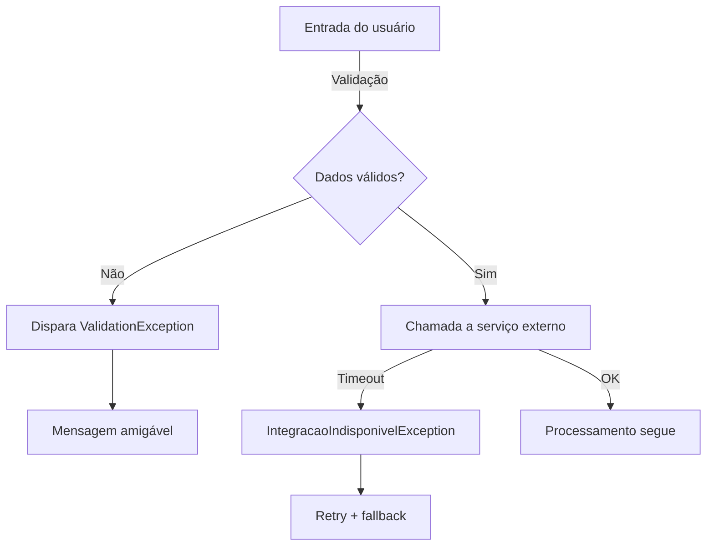

# Playbook de Exceções para o Sistema Bancário

Este guia auxilia a equipe na definição de políticas consistentes de tratamento de erros ao longo da APS 02 e das próximas entregas do projeto integrador.

## 1. Classificação das falhas

| Cenário                           | Tipo de exceção                                                 | Ação recomendada                                                               |
| --------------------------------- | --------------------------------------------------------------- | ------------------------------------------------------------------------------ |
| Falha de validação de entrada     | `IllegalArgumentException` (runtime)                            | Informe mensagem clara ao usuário e registre em nível `WARN`.                  |
| Serviço externo indisponível      | Exceção customizada `IntegracaoIndisponivelException` (checked) | Retentar conforme política de 3 tentativas e escalar notificação para suporte. |
| Erro de persistência irreversível | `RepositoryException` (runtime)                                 | Registrar em nível `ERROR`, iniciar rollback e notificar equipe imediatamente. |

## 2. Convenções de projeto

- **Pacote dedicado:** `br.edu.unifametro.banco.shared.exceptions`.
- **Sufixo obrigatório:** todas as exceções customizadas terminam com `Exception` e armazenam código/mensagem padrão.
- **Mensagem orientada ao diagnóstico:** inclua contexto (`idTransacao`, `idCliente`) e causa raiz (`cause`).
- **Logs estruturados:** utilize SLF4J com MDC (`transactionId`, `correlationId`).

## 3. Fluxos recomendados

## 4. Checklist para o Definition of Done

- [ ] Todos os blocos `try` liberam recursos com `try-with-resources` ou blocos `finally`.
- [ ] Exceções são traduzidas para o domínio (`*Exception`).
- [ ] Testes automatizados cobrem pelo menos um cenário de falha por caso de uso crítico.
- [ ] Logs possuem contexto suficiente para auditoria.

## 5. Referências rápidas

1. Tutorial oficial: <https://docs.oracle.com/javase/tutorial/essential/exceptions/>
2. Logging estruturado com MDC: <https://www.baeldung.com/mdc-in-log4j-2-logback>
3. Boas práticas de mensagens de erro: <https://martinfowler.com/ieeeSoftware/ErrorMessages.pdf>
